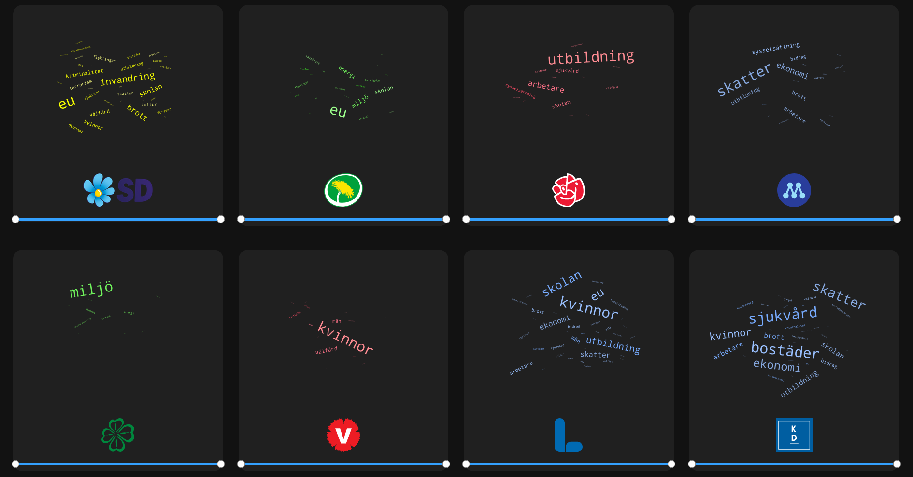

## Polinfo 

Wordclouds av anföranden ifrån https://data.riksdagen.se.  Använd sliderna för att välja vilken tidsperiod wordcloudsen skall vara genererade ifrån.

WordClouds använder sig av en [ord standardiserings lista](polinfo-explore/word-standards.txt) samt en ['filterings' lista](polinfo-explore/disallowed-words.txt). Bidrag till dessa listor är välkommna! Notera också att ordmolnen inte är av de "populäraste orden" från vardera parti, utan av de orden som är relativt mest populära. Ordmålnen består alltså av ord som ett visst parti säger mycket i relation till andra partier.

