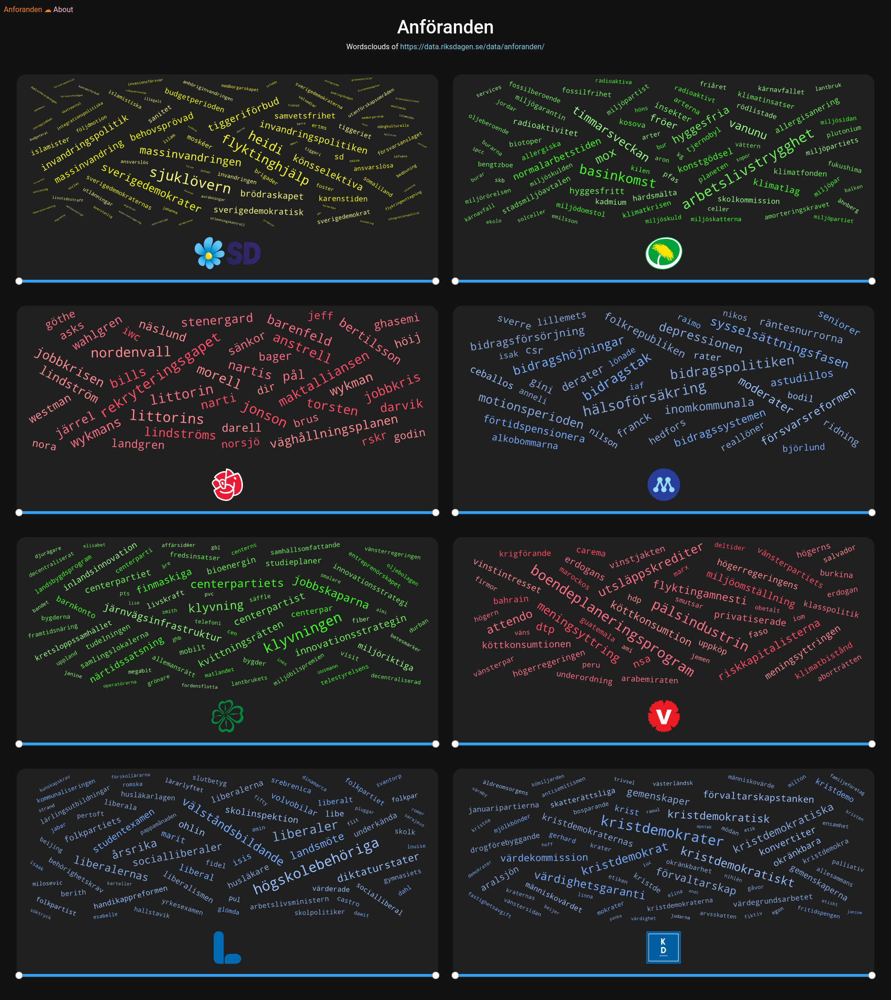

## Polinfo 

En hemsida som visualiserar data man kan hämta ifrån https://data.riksdagen.se, just nu kan man

* [Se Wordclouds av anföranden givna under valda perioder](#anföranden) (Se ord som partier använt i sina anföranden under olika tidsperioder)

#### Anföranden
Notera: WordClouds använder sig av en [ord standardiserings lista](polinfo-explore/word-standards.txt) samt en ['filterings' lista](polinfo-explore/disallowed-words.txt). Bidrag till dessa listor är väldigt välkommna!

  
